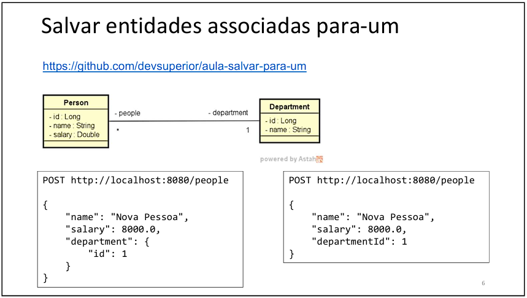
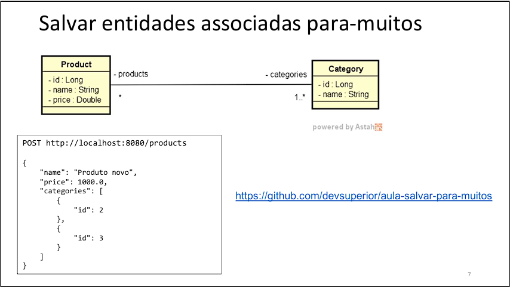

# Desenvolvedor:

## Juliano Martins de Souza

### Contatos

  
  
  
  

## Aulas do curso Spring Profissional do curso DevSuperior sobre a criação de CRUD utilizando classes relacionais

### Realização do CRUD para classes com relacionamento para um

O CRUD deve receber dois tipos de Json e realizar o armazenamento do novo
cadastro no banco de dados.

### Realização do CRUD para classes com relacionamento para muitos

O CRUD deve perceber o JSON destacado e realizar o armazenamento correto
no banco de dados.